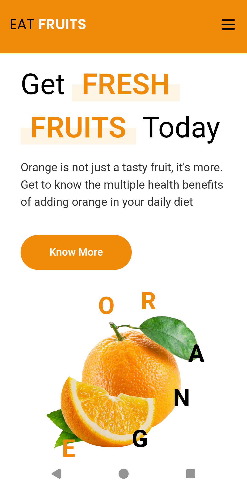
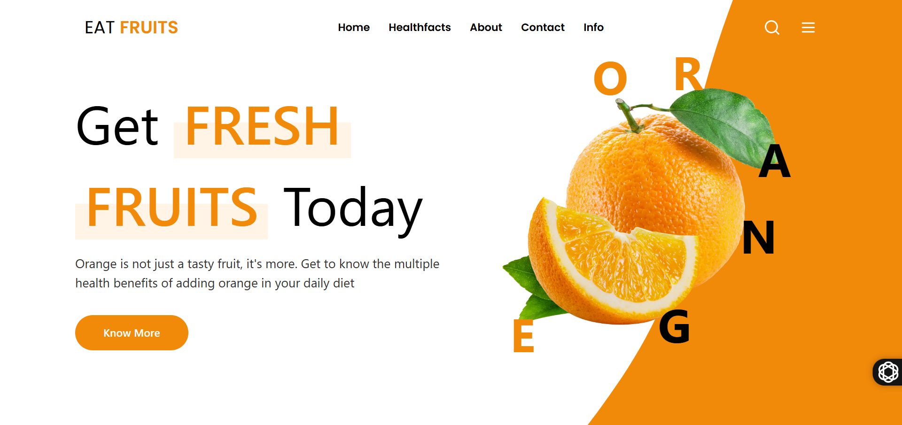

# Proyecto Next.js - Eat Fruits

Este es un proyecto creado con [Next.js]

## Instrucciones para ejecutar el proyecto

1. Clona este repositorio en tu máquina local:
   ```bash
   git clone https://github.com/NicoAlvarado10/reto-fresh-fruit.git
   ```

2. Accede al directorio del proyecto:
   ```bash
   cd MY-APP
   ```

3. Instala las dependencias necesarias:
   ```bash
   pnpm install
   ```

4. Inicia el servidor de desarrollo:
   ```bash
   pnpm run dev
   ```

5. Abre [http://localhost:3000](http://localhost:3000) en tu navegador para ver el resultado.

## Tecnologías utilizadas

- **Next.js**
- **Tailwind CSS**
- **Framer-Motion**
- **Lucide-react**

## Vista previa

### Versión móvil


### Versión de escritorio


## Tiempo de desarrollo

El desarrollo de este proyecto tomó un total de 8 horas.

## Despliegue
El despliegue se realizo en [Vercel]